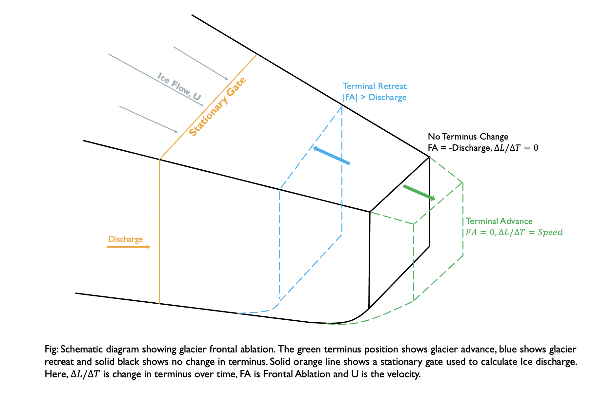

# GEOS 505: Research Computing in the Earth and Environmental Sciences

## Aman KC 

Email: [amankc@u.boisestate.edu](mailto:amankc@u.boisestate.edu)

 ## Smart Goals
 | Letter | Descrption |
 |--------|------------|
 | S       | Specific |
 | M | Measurable |
 | A | Achievable |
 | R | Relevant |
 | T | Time-bound |
 
## Brief Overview of the Research and use of Scientific Computing

My research is focused on mapping the spatio-temporal distribution of iceberg production and iceberg-sourced meltwater fluxes and querying those data to identify first-order controls on iceberg melting relative to other Greenland ice sheet freshwater sources.

For the research, I am focusing on the source of these freshwater sources i.e. Glaciers. We lack understanding on the precise timing of the iceberg discharge as it deviates from flux estimates due to the stochastic nature of iceberg calving. The above figure depict the principle that I would be using to get the estimates in terminus ablation using both discharge values and near terminus mass change incorporating terminus changes. 
